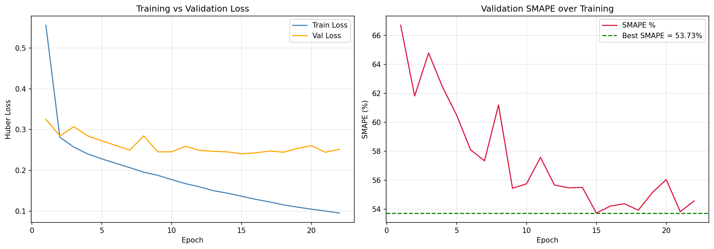

# Multimodal Product Price Prediction

Predicts e-commerce product prices by jointly learning from product 
descriptions and images using CLIP embeddings and a custom Deep Residual 
MLP architecture. Built for the **Amazon ML Challenge 2025**.

## Results

| Metric | Score |
|--------|-------|
| Validation SMAPE | 54.00% |
| Baseline (LightGBM + TF-IDF) | ~61% |
| Training samples | 50,000 |
| Validation samples | 25,000 |

## Training Curves



## Architecture
catalog_content ──► CLIP ViT-B/16 (text) ──► 512-dim embedding ──┐
                                                                 ├──► Fusion ──► Deep Residual MLP ──► Price
image_link ──────► CLIP ViT-B/16 (image) ──► 512-dim embedding ──┘

Structured features:
brand, pack size, unit normalization,
LDA topics (10), quality keyword flags

### Model Details
- **Encoder:** CLIP ViT-B/16 for both text and image modalities
- **Architecture:** 14-layer Deep Residual MLP
  - Input projection → 5 Residual Blocks → Bottleneck → Output head
  - Each block: LayerNorm → Linear → GELU → Dropout → Linear → skip connection
- **Loss:** Huber loss on log-price space
- **Optimizer:** AdamW with linear warmup + cosine annealing
- **Metric:** SMAPE (Symmetric Mean Absolute Percentage Error)

## Dataset

[Amazon ML Challenge 2025](https://www.kaggle.com/datasets/raghavdharwal/amazon-ml-challenge-2025)

| Column | Description |
|--------|-------------|
| `sample_id` | Unique product identifier |
| `catalog_content` | Product title + description + IPQ |
| `image_link` | Amazon CDN image URL |
| `price` | Target variable (train only) |

## How to Run

### On Kaggle (Recommended)
1. Create a new Kaggle notebook
2. Add dataset: `raghavdharwal/amazon-ml-challenge-2025`
3. Upload `notebook/amazon_ml_challenge_2025.ipynb`
4. Enable Internet in Settings (required for CLIP)
5. Run all cells sequentially

### Locally
```bash
pip install -r requirements.txt
jupyter notebook notebook/amazon_ml_challenge_2025.ipynb
```

## Key Design Decisions

**Why CLIP over BERT?**  
CLIP jointly trains text and image in a shared embedding space.
Text-image cosine similarity becomes a meaningful feature without
any additional alignment training.

**Why Residual MLP over plain MLP?**  
Residual connections solve vanishing gradients in deep networks.
The skip connection guarantees gradient flow regardless of depth,
allowing 14 layers to train stably.

**Why Huber loss?**  
Price distributions are heavily right-skewed with extreme outliers.
Huber loss is robust to high-price outliers while maintaining smooth
gradients for typical price ranges.

**Why log1p target transform?**  
Compresses price scale so gradient magnitudes are uniform across
cheap (₹50) and expensive (₹50,000) items.

## Tech Stack

Python · PyTorch · OpenAI CLIP · scikit-learn · pandas · NumPy
